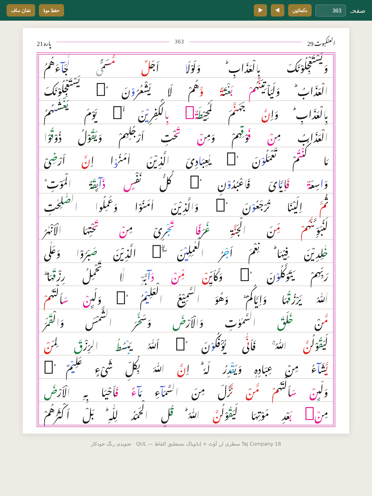

# Sabaq · سبق

A Quran reader built for memorisation — and for the person sitting across from
the child, listening.

## What it is

A pixel-faithful **16-line Indo-Pak Mushaf** with colour-coded tajweed, where
every word is individually addressable. That last part is what makes the real
features possible:

- **حفظ موڈ · hifz mode** — blur the page, recall from memory, tap a word to check
- **سماعت موڈ · listening mode** — tap the word where the student stumbled.
  One tap marks a **لقمہ** (had to be prompted), a second turns it into an
  **اٹکنا** (faltered but recovered alone), a third clears it. No dialog, no
  mode switch — the listener's eyes stay on the page. Both counts show per page.
- Session recording, revision queue, mutashabihat pairing *(planned)*

## Languages

The interface reads in **اردو**, **English** and **عربي**. On first run the
language is chosen from the device — Pakistan and India get Urdu, Arab regions
get Arabic, everywhere else English — using the device's own language list and
timezone. No network call, no IP lookup. It can be changed in the header at any
time and is remembered.

The Quranic text is always Arabic, and the page is always right-to-left, in all
three. The printed page is the memory; only the chrome around it changes.

## Navigation

- Jump by **surah** (all 114) or **juz** (all 30), or type a page number
- Arrow keys on desktop, swipe on touch
- Opens at page 1 for a new reader, and at the last page read for a returning one

## Status

| | |
|---|---|
| Pages | 548 |
| Words | 83,668 |
| Tajweed marks | 77,835 |
| Ayah alignment | 99.89% |

Reader, hifz mode, and luqma/atakna marking all work. Session recording and
audio sync are next — `useListening` already timestamps every mistake, but
nothing starts or stops a session yet.

## Running it

    npm install
    npm run dev          # http://localhost:5173

    npm run build        # tsc + production bundle
    npm run preview      # serve the built output

    npm run pipeline                 # rebuild quran.sqlite from data/source
    python3 tests/verify_pages.py    # render and verify all 548 pages

## Data

Layout, word text and tajweed annotations are rebuilt from open datasets by the
scripts in `pipeline/`. Text should be validated against an authoritative
printed edition before release — see `docs/DATA.md`, which also records a real
edition difference on page 363.

## Author

Built by **Zahid Abbasi** — [xuro.net](https://xuro.net)

Made for those memorising the Quran, with the intention of sadaqah jariyah.

## Licence

Code: MIT © Zahid Abbasi.

The Quranic text is the word of Allah ﷻ, sent for all mankind. It is not ours to licence, and no claim is made over it.
