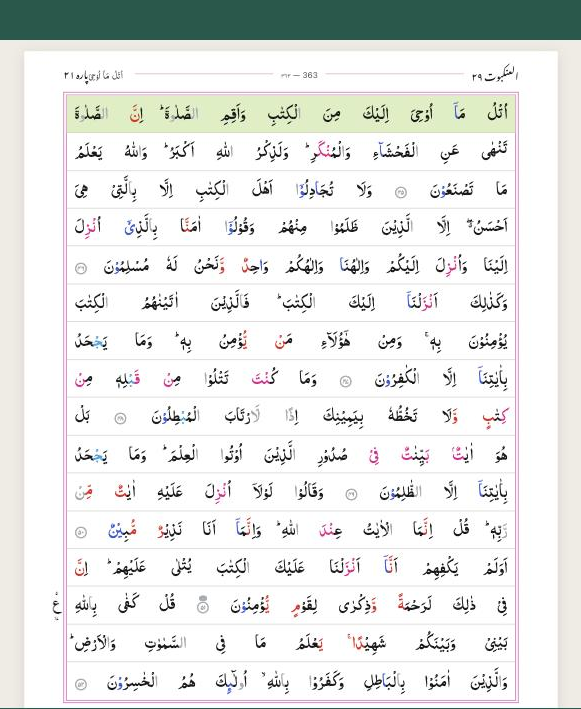
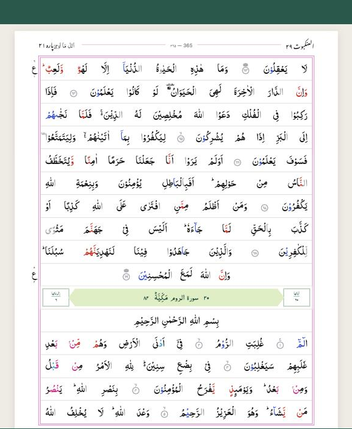
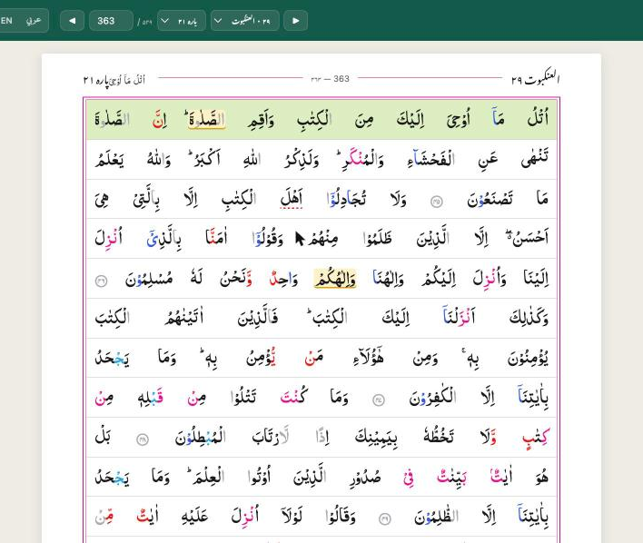
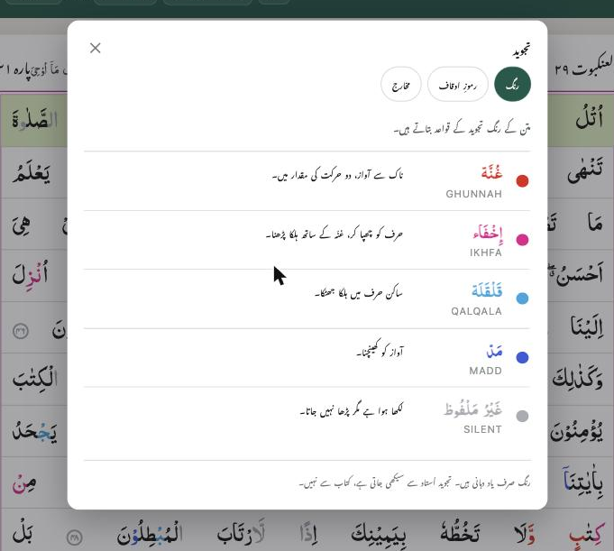
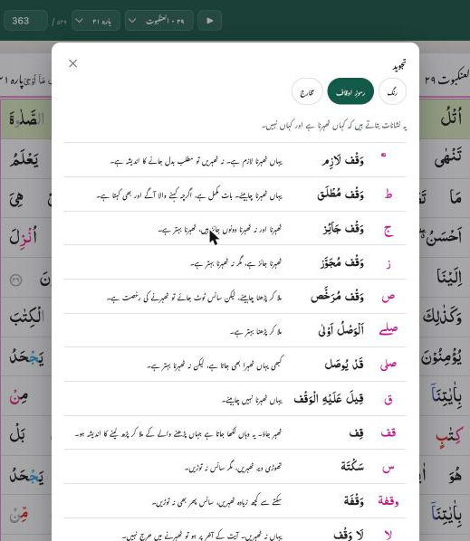

# Quran for Hifz · قرآن برائے حفظ

[quranforhifz.com](https://quranforhifz.com)

A Quran reader built for memorisation — and for the person sitting across from
the child, listening.

  
  

## What it is

A pixel-faithful **16-line Indo-Pak Mushaf** with colour-coded tajweed, where
every word is individually addressable. That last part is what makes the real
features possible:

- **حفظ موڈ · hifz mode** — blur the page, recall from memory, tap a word to check
- **سماعت موڈ · listening mode** — tap the word where the student stumbled.
  One tap marks a **لقمہ** (had to be prompted), a second turns it into an
  **اٹکنا** (faltered but recovered alone), a third clears it. No dialog, no
  mode switch — the listener's eyes stay on the page. Both counts show per page.
- **Review panel** — after a whole para, every mark listed with its page and
  ayah, grouped by page, tap to jump back
- Audio: reference recitation, student recording, mistake detection *(planned —
  see `docs/AUDIO.md`)*

## Faithful to the printed page

Everything the print puts on a page is here, and none of it is computed:

- **ع** ruku signs, with the surah ruku number above and the para ruku below
- **السجدة** — all fourteen sajdahs, numbered
- **الربع · النصف · الثلاثة** — the para quarters, in the margin
- **منزل** at the foot of every page
- the **surah heading band** — ayah count, ruku count, Makki/Madani, and the
  surah's place in the order of revelation
- the **green band** on the line where a para opens
- each para's **name** in the page header (۲۱ اتل مآ اوحی)

Para start pages are read off the print itself, not derived from juz metadata —
the Indo-Pak para division and the juz division disagree in both directions.
See the header comment in `src/data/juzStart.ts`.

## Tajweed reference

The three references the printed Mushaf carries in its back matter, in all
three languages:

- **Colours** — ghunnah, ikhfa, qalqala, madd, and the unpronounced letters
- **Pause marks** — the fifteen waqf signs
- **Makharij** — the mouth diagram and the names of the teeth

Each colour swatch is painted by the same CSS class the Quran text uses, so the
key cannot drift from the page.

## Languages

The interface reads in **اردو**, **English** and **عربي**. On first run the
language is chosen from the device — Pakistan and India get Urdu, Arab regions
get Arabic, everywhere else English — using the device's own language list and
timezone. No network call, no IP lookup. It can be changed in the header at any
time and is remembered.

The Quranic text is always Arabic, and the page is always right-to-left, in all
three. The printed page is the memory; only the chrome around it changes.

## Navigation

- Jump by **surah** (all 114) or **juz** (all 30), or type a page number
- Arrow keys on desktop, swipe on touch
- Opens at page 1 for a new reader, and at the last page read for a returning one
- Progress through the current para under every page — which page of how many,
  and how many are left

## Status

| | |
|---|---|
| Pages | 548 |
| Words | 83,668 |
| Tajweed marks | 77,835 |
| Ayah alignment | 99.89% |

Reader, hifz mode, luqma/atakna marking, the review panel, the margin marks and
the tajweed reference all work. Audio is next — `useListening` already
timestamps every mistake, but nothing starts or stops a session yet. The
architecture for reference recitation, recording and mistake detection is
written up in `docs/AUDIO.md`.

Known gaps: the Nastaleeq font still loads from a CDN, which breaks the offline
promise in a native build; words sit in uniform gaps where the print stretches
letters (kashida justification); para 27's ثلاثہ is the one missing quarter
mark, 89 of 90.

## Running it

    npm install
    npm run dev          # http://localhost:5173

    npm run build        # tsc + production bundle
    npm run preview      # serve the built output

    npm run pipeline                 # rebuild quran.sqlite from data/source
    python3 tests/verify_pages.py    # render and verify all 548 pages

## Data

Layout, word text and tajweed annotations are rebuilt from open datasets by the
scripts in `pipeline/`. Text should be validated against an authoritative
printed edition before release — see `docs/DATA.md`, which also records a real
edition difference on page 363.

## Author

Built by **Zahid Abbasi** — [xuro.net](https://xuro.net)

Made for those memorising the Quran, with the intention of sadaqah jariyah.

## Licence

The Quranic text is the word of Allah ﷻ, sent for all mankind. It is not ours
to licence, and no claim is made over it.

Everything else divides:

| | |
|---|---|
| Code — `src/`, `pipeline/`, `scripts/`, build config | MIT © Zahid Abbasi |
| `public/data/quran.sqlite` | derived from the QUL databases — **use under QUL's terms, not MIT** |
| `public/fonts/indopak-nastaleeq.ttf` | redistributed from QUL, under its own licence |
| `public/img/makharij-*.webp` | the publisher's artwork — **not MIT**, see NOTICE §5 |

The MIT licence covers the code that builds the database, not the data inside
it. **[`NOTICE`](NOTICE) records where every part came from**, including one
unresolved question that should be settled before this repository is made
public.

## Provenance

Layout, word text and tajweed annotations are built from open datasets — see
`pipeline/README.md`. The app models one specific printed copy: a 16-line
Indo-Pak Mushaf, Shan Maktaba Madina Printing Press, March 2011, certified by
six named qaris and two registered proof-readers of the Punjab Auqaf
Department. Page offsets, para start pages and every margin mark were verified
against it. `docs/DATA.md` records the investigation.

The text has **not yet been reviewed by a qari**. Until it has, treat this as
pre-release.
